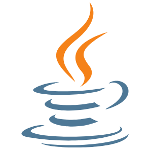
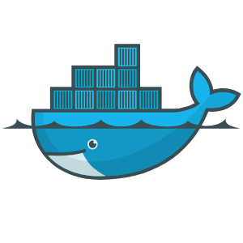

 <samp> Hi, my name is Sérgio. I am a software engineering college student who is currently researching optimization. In my repos you'll find projects created using 
---

## Languages and Tools:

 
<table>
<tbody>

<td align="center" width="20%">
<b>
C++
</b> 
 
</td>

<td align="center" width="20%">
<b>
Java
</b> 
 
</td>

<td align="center" width="20%">
<b>
Python
</b> 
 
</td>
</tr>

<tr>
<td align="center" width="20%">
<b>
Firebase
</b> 
 
</td>

<td align="center" width="20%">
<b>
Flutter
</b> 
 
</td>

<td align="center" width="20%">
<b>
Julia
</b> 
 
</td>
</tr>

<tr>
<td align="center" width="20%">
<b>
Docker
</b> 
 
</td>

<td align="center" width="20%">
<b>
JavaScript
</b> 
 
</td>

<td align="center" width="20%">
<b>
HTML
</b> 
 
</td>
</tr>

</tbody>
</table>

____

<h3 align="center"> Other Accounts 📫 </h3>

____